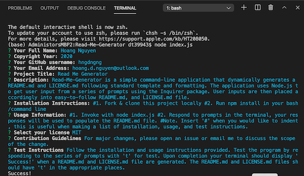

  # Read Me Generator 
  
  
  ## Description 
  Read-Me-Generator is a simple command-line application that dynamically generates a README.md and LICENSE.md following standard template and formatting. The application uses Node.js to get user input from a series of prompts using the Inquirer package. User inputs are then placed accordingly into an easy-to-follow README.md, and LICENSE.md file.

  ## Table of Contents
  * [Installation](#installation)
  * [Usage](#usage)
  * [License](#license)
  * [Contributing](#contributing)
  * [Test Instructions](#test-instructions)
  * [Questions](#questions)

  ## Installation
  
    1. Fork & clone this project locally   
    2. Run npm install in your bash/command line

  ## Usage
      
    1. Invoke with node index.js   
    2. Respond to prompts in the terminal, your responses will be used to populate the README.md file.   
    Note. Insert '#' when you would like to indent, this is useful when 
    making a list of installation, usage, and test instructions.
    
  Video Walkthrough  
    
  Image of Prompts    
  [  

  ## License
  MIT (c) Hoang Nguyen  
  See LICENSE.md for details.

  ## Contributing
  For major changes, please open an issue or email me to discuss the scope of the change.

  ## Test Instructions
  Follow the installation and usage instructions provided. Test the program by responding to the series of prompts with 't' for test. Upon completion your terminal should display 'Success!' when a README.md and LICENSE.md file are generated. The README.md and LICENSE.md files should have 't' in the appropriate places.
  
  ## Questions
  For questions, reach out to me here:  
  Github: https://github.com/hngdngng      
  Email: [hoang.d.nguyen@outlook.com](mailto:hoang.d.nguyen@outlook.com)
  